<h1 align="center">Hi &nbsp; 👋,    I'm Vishnu Priya VR!</h1>
<h3 align="center">Principal AI Engineer | Architecting Agentic Workflows & Multi-Agent Systems</h3>

 
   

 
  
  

### 🚀 About Me
I am a **Principal AI Engineer** specializing in architecting enterprise **Generative AI systems** across diverse domains—including **cybersecurity automation**, real-time **agent assist copilots**, and high-scale **fintech chatbots**—all backed by production-grade **MLOps**.
I focus on moving beyond simple LLM calls to building autonomous, deterministic agentic systems that solve complex enterprise challenges.

- 🤖 **Currently Focused On:** Architecting agentic workflows for SOC automation and proactive threat hunting.
- 🏗️ **Core Expertise:** RAG & GraphRAG optimization, Agentic AI (Function Calling and Tool Calling), and productionizing LLMs at scale.
- 🎙️ **Community:** Former **Rasa Community Chapter Lead** (Chennai & Bengaluru); organized 12+ meetups for 300+ members.
- ✍️ **Writing:** I maintain **Whispering Wasps**, focusing on how Markdown and reasoning models are redefining the AI stack.

### 🛠️ Tech Stack & Skills
- **AI/ML:** Generative AI, RAG, GraphRAG, Agentic Workflows, LangChain, LlamaIndex, CrewAI, Rasa.
- **NLP/CV:** NER, OCR (EasyOCR, Tesseract), ASR/STT (Deepgram), TTS (Cartesia).
- **Backend & Infra:** FastAPI, Docker, Kubernetes (GCP/Azure), MLOps (Datadog, Wiz.io, Nexus IQ, ArgoCD).
- **Databases:** MongoDB, SQL, Vector Databases.

### 🧪 AI Systems Lab

**AI Systems Lab** is my build-in-public portfolio for exploring production AI architecture through working prototypes, measurable evaluations, and documented engineering trade-offs.

#### 🛡️ Lab 01 — MCP-Based SOC Copilot

A security operations copilot that converts heterogeneous security alerts into structured, evidence-grounded triage recommendations while retaining human authority over sensitive decisions.

**Target architecture:**

`Security alert → OCSF normalization → Security SLM router → Private MCP server → Grounded retrieval → Analyst recommendation → Human decision`

**Engineering principles:**

- Standardize multi-vendor alerts using **OCSF** before applying AI.
- Use a smaller model for routing and reserve larger models for complex investigations.
- Keep changing knowledge—threat intelligence, incident history, and playbooks—in **RAG**.
- Expose security capabilities through thin, typed, read-only **FastMCP tools**.
- Require traceable evidence and human review for high-risk decisions.
- Benchmark rules, prompted SLMs, and fine-tuned SLMs on the same held-out dataset.
- More details captured here: [Building a Safer AI Copilot for Security Teams: Week 1](https://www.linkedin.com/pulse/building-safer-ai-copilot-security-teams-week-1-vishnu-priya-vr-hxnnc/)

**Week 1 delivered:**

- 8 representative SOC alert scenarios
- 50 reviewed synthetic golden alerts
- Versioned Pydantic and OCSF contracts
- 8 FastMCP tool contracts
- Threat model and testable security invariants
- Working `normalize_alert` vertical slice
- 60 passing automated tests

> This is a controlled engineering prototype using public and synthetic data. It does not connect to production security systems or execute remediation.

🔗 **Engineering repository:** Private implementation; selected architecture, evaluation, and design artifacts are shared publicly through portfolio updates.

📖 **Current focus:** Implementing deterministic SOC tools and benchmarking rules against prompted Security SLMs before deciding whether fine-tuning provides measurable value.

### 📈 Impact Highlights
- **Agentic Workflows:** Reviewed and redesigned a 24/7 autonomous SOC detection system with response latency < 2 minutes.
- **RAG Optimization:** Improved retrieval accuracy by 20% and reduced latency by 60% through structured chunking strategies.
- **Production Scale:** Deployed conversational agents handling 10k+ monthly conversations with 99.7% uptime.

### 📝 Recent Technical Blogs
- [Why AI Agents Fail in Production - and the Architecture That Fixes Them](https://medium.com/whispering-wasps/why-ai-agents-fail-in-production-and-the-architecture-that-fixes-them-033b10b1ce87)
- [VRAM Is Zero-Sum: Why Quantization and KV Cache Are Not Rivals in Production LLM Serving](https://www.linkedin.com/pulse/vram-zero-sum-why-quantization-kv-cache-rivals-production-vr-mpe0c/)
- [Kubernetes Troubleshooting with K8sGPT: AI-Assisted SRE Guide](https://medium.com/generative-ai/kubernetes-troubleshooting-with-k8sgpt-ai-assisted-sre-guide-28752c72acf9)
- [Parallel Decoding Without Extra Heads: Inside Jacobi Forcing](https://medium.com/whispering-wasps/parallel-decoding-without-extra-heads-inside-jacobi-forcing-e7ec9e9fc529)
- [Why Markdown Might Be All We Need: My Take](https://medium.com/whispering-wasps/why-markdown-might-be-all-we-need-my-take-8946b22a8ca6)
- [Stop Engineering Context, Start Predicting It](https://medium.com/towards-deep-learning/stop-engineering-context-start-predicting-it-61cc07a2b7db)
- [Reasoning vs. Rules: How Claude Mythos Broke Security’s Old Game](https://medium.com/whispering-wasps/reasoning-vs-rules-how-claude-mythos-broke-securitys-old-game-43dfbc82fd42)
- [REASONING vs RULES : Part 2 — The Feedback Engine: How the Colosseum Learns Faster Than Threats Evolve](https://medium.com/whispering-wasps/reasoning-vs-rules-part-2-the-feedback-engine-how-the-colosseum-learns-faster-than-threats-3f9eccb4c624)
- [Productionize ML/DL Models as Easy as a Pie: BentoML](https://medium.com/whispering-wasps/productionize-ml-dl-models-as-easy-as-a-pie-bentoml-36247374446f)
  

### 🤝 Connect with me:

  &nbsp;
  &nbsp;
  

### 📊 GitHub Stats

  

  

